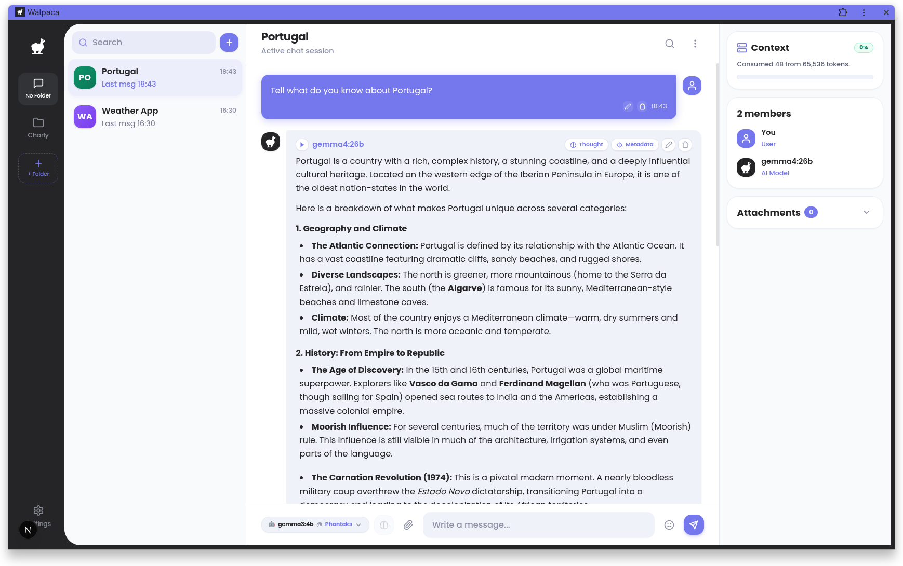
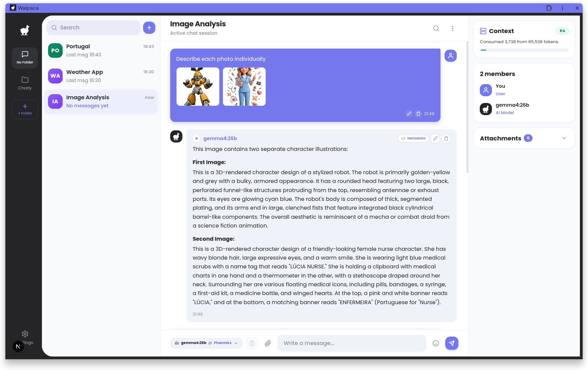
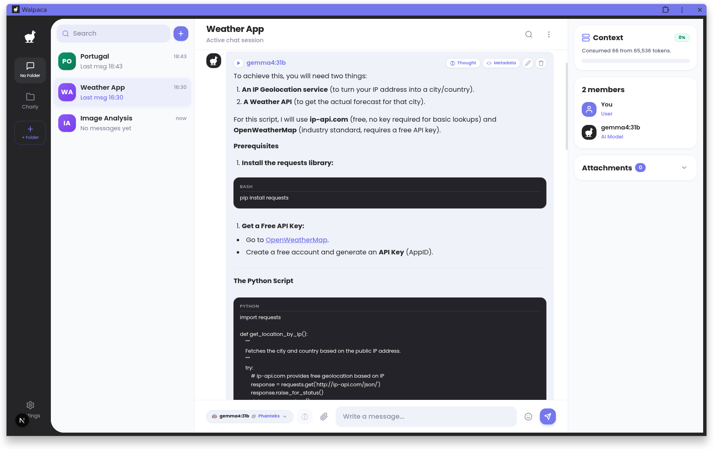

<p align="center">
  
</p>

<h1 align="center">Walpaca</h1>

<p align="center">
  Web version of the native GTK AI client: <a href="https://github.com/Jeffser/Alpaca">Jeffser/Alpaca</a>
</p>

---

Walpaca is inspired by [Jeffser/Alpaca](https://github.com/Jeffser/Alpaca). After using the native GTK version daily, switching between a desktop and a laptop meant manually syncing the local `.db` file between machines. 

The question arose: *What if Alpaca had a web interface accessible anywhere on the local network or VPN?* Walpaca is the answer.

Instead of creating a new database format, Walpaca mounts the exact same SQLite database file (`alpaca.db`) used by the GTK app, wrapping it with a lightweight backend API and a modern web frontend. Your existing chats, configurations, and models remain fully compatible.

> [!WARNING]
> This project is not affiliated with Ollama. The author is not responsible for any damages to your device or software caused by running code generated by AI models.

> [!WARNING]
> Purely AI-generated issues and pull requests will be rejected. Repeated offenses will result in a ban from the repository. AI can be a useful tool, but contributors must understand, test, and ensure code readability before submitting.

---

## Features

- [x] Talk to multiple models in the same conversation
- [x] Delete and edit messages
- [x] Regenerate messages
- [ ] Pull and delete models directly from the UI
- [x] Image recognition (multimodal models)
- [x] Document recognition (plain text files)
- [x] Code syntax highlighting
- [x] Multiple concurrent conversations
- [x] LLM Response background handler when browser is refreshed of closed.
- [ ] System notifications
- [x] Import chats
- [x] Export chats
- [x] Fork chats
- [x] Lock Pin
- [ ] YouTube video recognition (transcript queries)
- [ ] Website recognition (web scraping via URL)
- [ ] Connect to cloud-hosted OpenAI-compatible APIs using personal API keys
- [x] Text-to-speech integration via Kokoro TTS

---

## Screenshots

Normal conversation | Image recognition | Markdown to HTML
:------------------:|:-----------------:|:----------------:
 |  | 

---

## Tech Stack

- **Frontend**: Next.js (App Router), React, Tailwind CSS, Zustand
- **Backend**: Python, Flask, Flask-SQLAlchemy, Flask-CORS
- **Database**: SQLite (`alpaca.db` shared with GTK Alpaca)
- **Speech Synthesis**: Kokoro TTS Server
- **Orchestration**: Docker & Docker Compose

---

## Quick Start

### Prerequisites

- [Docker](https://docs.docker.com/get-docker/) & [Docker Compose](https://docs.docker.com/compose/)
- An existing `alpaca.db` file (from GTK Alpaca or generated on first run)
- Running [Ollama](https://ollama.com/) instance accessible from your host/network

### Running with Docker Compose

1. Clone the repository:
   ```bash
   git clone https://github.com/c42759/walpaca.git
   cd walpaca
   ```

2. Configure environment variables in `.env`:
   ```bash
   NETWORK_ADDRESS=127.0.0.1
   VPN_ADDRESS=127.0.0.1
   CORS_DOMAINS="http://localhost:3000"
   KOKORO_API_KEY=your-kokoro-key-here
   ```

3. Ensure `alpaca.db` is present in the project root:
   ```bash
   touch alpaca.db
   ```

4. Launch services:
   ```bash
   docker compose up -d
   ```

5. Access the web interface at `http://localhost:3000`.

---

## Contributing

Contributions are welcome! Please read [CONTRIBUTING.md](CONTRIBUTING.md) before submitting an issue or pull request.

---

## Thanks & Acknowledgments

- Huge thanks to [Jeffser](https://github.com/Jeffser) for creating the original [Alpaca](https://github.com/Jeffser/Alpaca) GTK client that inspired this web version.
- Thanks to everyone supporting and testing self-hosted AI interfaces.

---

## License

This project is licensed under the terms found in [COPYING](COPYING).
